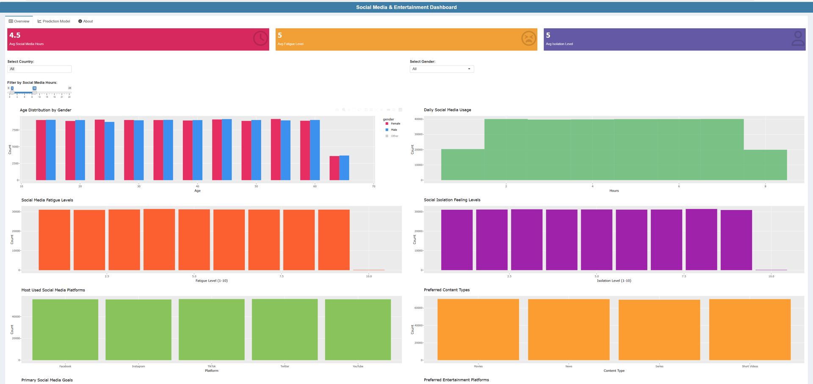

# Social Media and Entertainment Dashboard
An interactive dashboard built in R and Shiny to visualize social media performance metrics. The app allows users to explore data trends, platform comparisons, and engagement insights in a user-friendly interface.



🔗 [App Live Demo](https://happinessndanu1.shinyapps.io/Social-Media-Dashboard/)

Key Features for the dashboard include:
- Interactive data visualization with `plotly` and `ggplot2`
- Filters for date range, platform, and engagement type
- Summary cards showing top-level metrics
- Responsive layout

Technologies used include:
- R
- Shiny
- ggplot2 / plotly
- dplyr / tidyr
- shinydashboard / shinyWidgets
## 📁 How to Run Locally

```r
# Clone this repo
git clone https://github.com/happiness-ndanu/Social-Media-and-Entertainment-Dashboard.git

# Open in RStudio
setwd("TB_Kenya")

# Run the app
shiny::runApp()
```
Author: Happiness Ndanu Mutisya
- Data Analyst | R Developer | Mental Health Advocate  
- 📧 happiness.ndanu.m@gmail.com  
